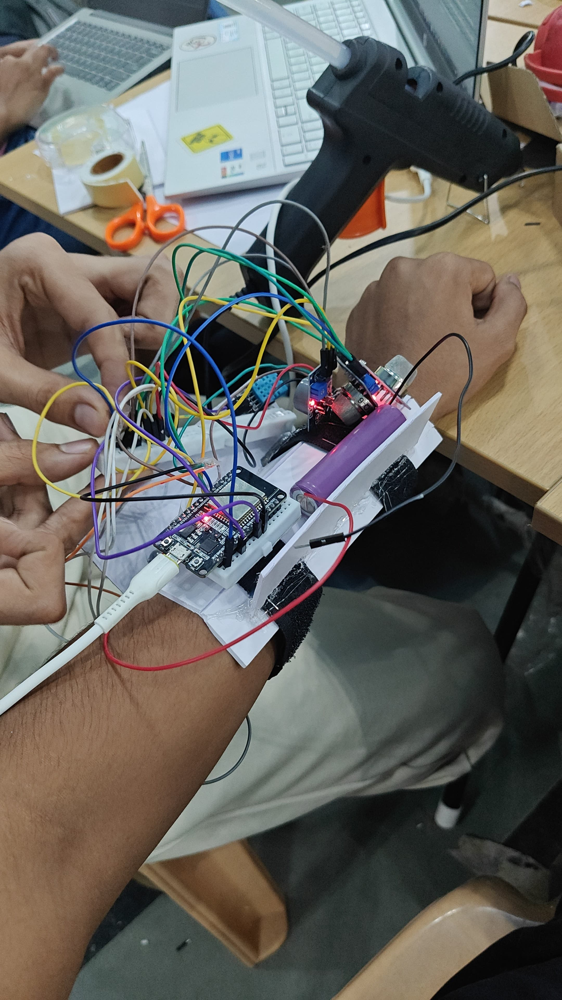
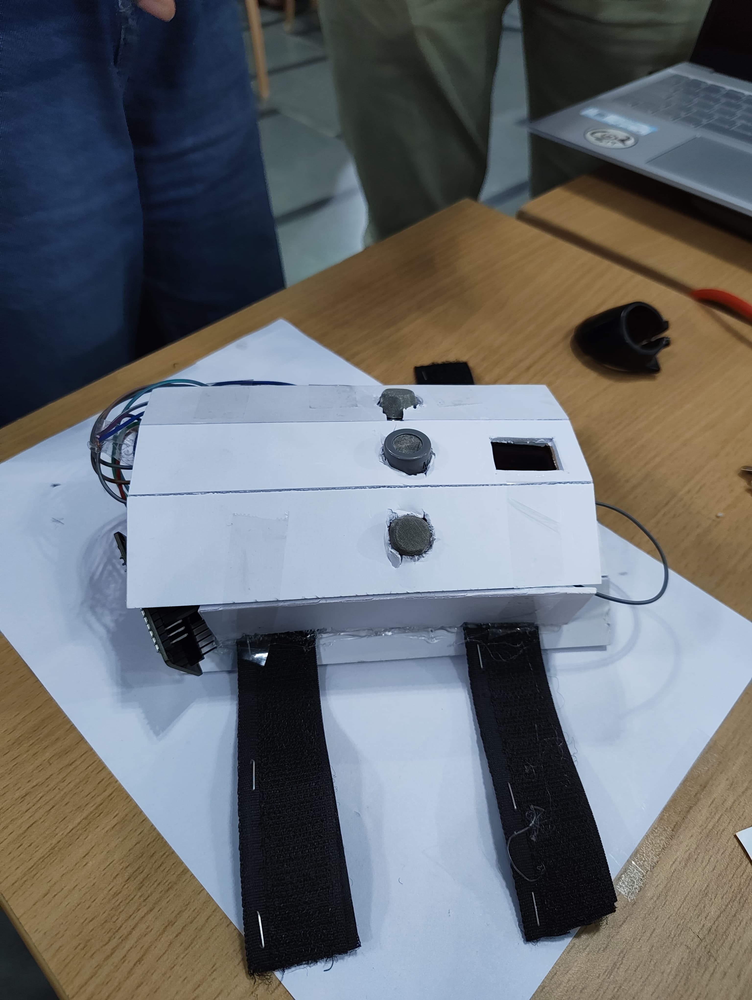

# SafeX – Real-Time Wearable Safety Monitoring System

SafeX is a wearable IoT-based safety monitoring device designed to track vital signs and environmental hazards in real time for workers operating in high-risk environments.

This project was developed for **Smart India Hackathon 2025** under the Disaster Management theme.

🏆 **Winner – Smart India Hackathon 2025 Internal Hackathon**  
Hosted by **AI Brewery at Siddaganga Institute of Technology**

---

## Problem Statement

**Problem Statement ID:** SIH25213  
**Title:** Integrated Wearable Device for Real-Time Monitoring of Vital Parameters, Gas Exposure, and Fatigue  
**Theme:** Disaster Management  
**Category:** Hardware  
**Team Name:** SensoNova 1

Industries such as mining, chemical plants, and disaster zones expose workers to hazardous gases and extreme working conditions. Real-time monitoring systems are essential to detect dangerous conditions early and enable rapid response.

---

## Demo

### Project Demonstration Video

[Watch Demo](./demo/safeXDashboard.mp4)

### Hardware Prototype

  
  

---

## Dashboard

The monitoring dashboard displays real-time readings transmitted from the wearable device.

Metrics displayed include:

- Heart Rate (bpm)
- Oxygen Saturation (SpO₂)
- Temperature
- Humidity
- CO Gas Sensor Output
- LPG Gas Sensor Output
- Device Status
- System Alerts

---

## Workflow

1. ESP32 wearable sensors capture vital and gas data  
2. Data is transmitted via **MQTT / MQTTS**  
3. Backend processes data using **Node.js + Express**  
4. Data stored in **MongoDB**  
5. Dashboard built with **Next.js + React** displays real-time readings and alerts  

---

## Key Features

- Real-time monitoring of **heart rate, SpO₂, temperature, and humidity**
- Detection of **hazardous gases such as CO and LPG**
- Live telemetry dashboard displaying sensor data
- Wireless connectivity via **Wi-Fi / BLE**
- Instant alerts during abnormal conditions
- Device status monitoring
- Secure data transmission using **MQTTS**

---

## System Architecture

### Hardware

- **ESP32-S3 microcontroller**
- **MAX30102 sensor** for heart rate and SpO₂ monitoring
- **Gas sensors** for CO and LPG detection
- **Humidity and temperature sensors**

### Software

**Firmware**
- C / C++
- ESP-IDF
- Sensor data acquisition

**Backend**
- Node.js
- Express

**Database**
- MongoDB

**Dashboard**
- Next.js
- React

**Communication**
- MQTT / MQTTS
- MQTTX for testing

---

## Impact

This system improves safety in high-risk environments by enabling continuous monitoring of workers and early detection of dangerous conditions.

Potential applications include:

- Mining operations
- Chemical industries
- Disaster response teams
- Hazardous industrial environments
- Military and emergency personnel monitoring

---

## Future Improvements

- Historical data storage and analytics
- Cloud-based monitoring platform
- Mobile monitoring application
- AI/ML-based fatigue detection
- Predictive safety alerts

---

## Hackathon Details

**Event:** Smart India Hackathon 2025  
**Problem Statement ID:** SIH25213  
**Theme:** Disaster Management  
**Team:** SensoNova 1  

---

## Team

Team **SensoNova 1**

- Devank Nambiar — Team Lead
- Trisha Roshan
- Dhruthi RS
- Mithun R
- Sharadhi Hn
- Logeshwar

---

## License

This project is licensed under the **MIT License**.
